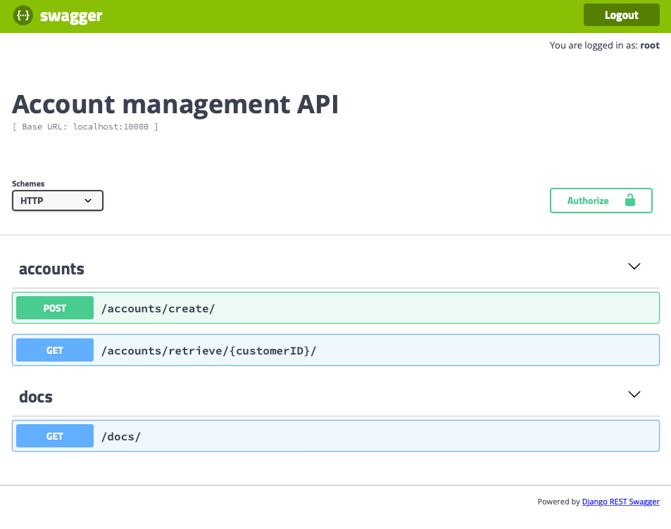
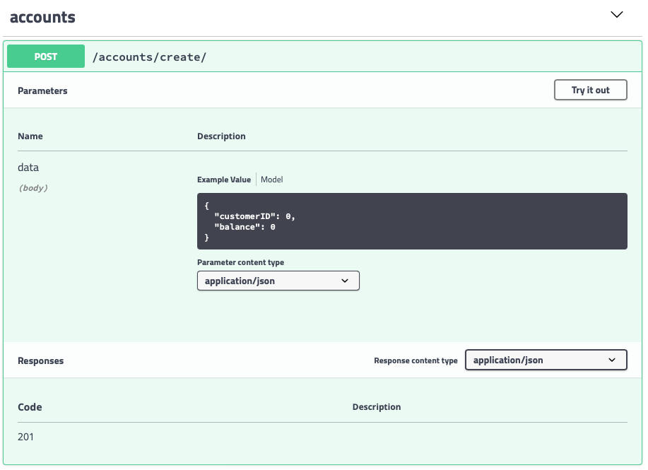
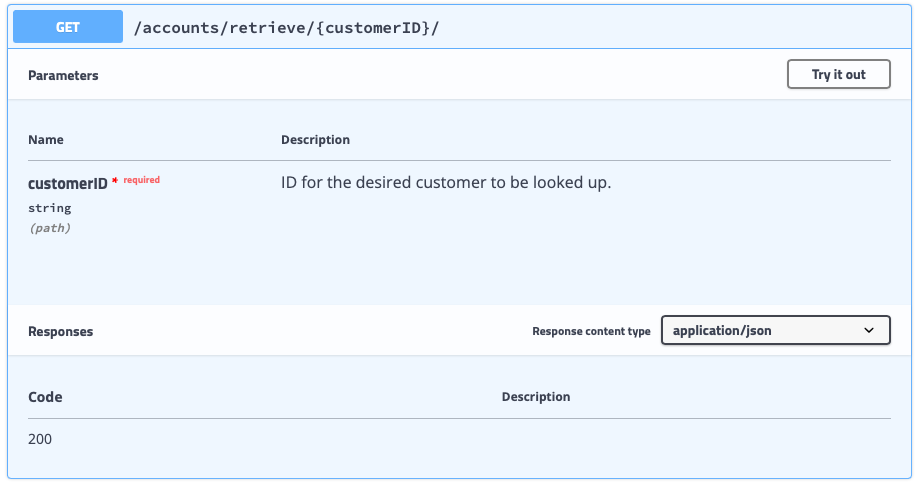

# Account management REST API
This repository contains the source code of the back office for managing accounts, and was developed using Django. This application has 2 endpoints for creating new accounts for existing users and for retrieving account and user information, and the django admin console for managing the content of the database tables. The database used `Postgres 14`, the API was documented using `Swagger`, and `Docker` was used for easier deployment.

## Account creation - POST

The endpoint for creating user accounts was implemented considering the following requirements:
 * `customerID` and `initialCredit` should be provided;
 * If the `customerID` is not registered in the database, no account is created;
 * If the `customerID` exists, a new account is created with a balance equal to `initialCredit`;
 * If `initialCredit` is equal to 0, no transaction is created;
 * If `initialCredit` is not 0, an automatic transaction is created with an amount equal to `initialCredit`.

## Account retrieval - GET

The endpoint for obtaining account information was implemented considering the following requirements:
* If the `customerID` exists and has an account registered in the system, the endpoint retrieves the following information: name, surname, balance and list of transactions.

# Deploying the solution

To deploy the solution, please follow the provided installation guidelines.

## Setting up .env file

Please create an `.env` file based on `.env-example` where the required ENV variables will be defined.

### Postgres variables

  POSTGRES_DB        : defines the database's name to be used.   
  POSTGRES_USER      : defines the postgres username.   
  POSTGRES_PASSWORD  : defines the postgres password.   

### Django variables
PORT : defines the port for the Django server (development mode)

## Building the system using Docker-compose
	cd docker/
	docker-compose build
	docker-compose up -d

After running `docker-compose up -d` the system should have initiated two different Docker containers, one for the database and another for the API. 

## Create Admin account in Django
Creating an Admin account allows the user to easily access and manage the database, enabling easy management of users, accounts and transactions. To do it, provide the desired username and email on the last command, replacing `root` and `root@dummy.com`.
	
	docker exec -it tekever_api bash
	cd src/
	python manage.py createsuperuser --username root --email root@dummy.com

The user will then be prompted to set the password for the admin account.

## Populate database with dummy data for testing
To ease the testing of the system, it is possible to automatically populate the database with dummy users and accounts simply by running:

	python manage.py populate_db

# Using the system
Once everything is set up the system will be available at `http://localhost:$PORT/`, where $PORT is the PORT defined in the `.env` file. For simplicity purposes, we will use PORT=8000 onwards.

## Accessing the Django Admin console
To access the Admin console, go the admin view through `http://localhost:8000/admin/`. A dialog box will appear prompting the insertion of the admin credentials. Once successfully logged in, the user will have three key views on the left:
* `Users`: used to manage and register new customers in the system;
* `Accounts`: used to register new bank accounts for existing customers, and to manage existing bank accounts;
* `Transactions`: used to view and create new transactions on existing accounts.

## Accessing the Swagger docs
Documentation on the API schema is provided at `http://localhost:8000/docs/`. Here, the user can view and easily test the implemented creation and retrieval endpoints through the `Try it out` option. The user should have a view as shown next.

